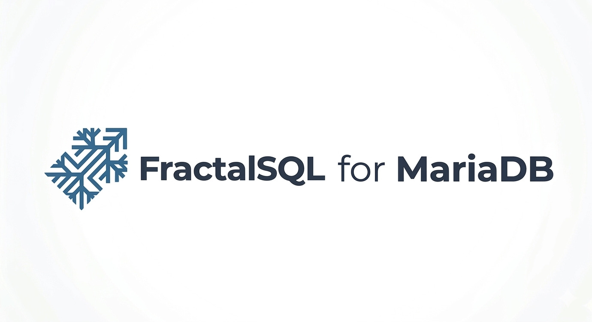

<p align="center">
  
</p>

# Sovereign Reasoning Setup Guide

The **Cognition Tier** is the intelligence layer of FractalSQL. It provides
a pluggable bridge that lets MariaDB call Large Language Models (LLMs) and
embedding providers directly from SQL.

By bringing reasoning directly into the MariaDB backend, FractalSQL lets you
synthesize, analyze, and reason over your data without an external
application-middleware hop. Sovereignty here is a deployment choice, not a
guarantee baked into every provider: local models (Ollama/vLLM) keep data
on your own infrastructure, while cloud providers (Bedrock, Azure OpenAI,
Vertex) send it to that provider under your own account and compliance
agreement.

---

## 🧠 The Cognition Model

The Cognition tier provides `fractal_reason(session_id, query
[, context])`. Unlike traditional RAG, which relies on external
orchestrators, FractalSQL performs the synthesis inside the backend:

1. **Context Assembly**: You use ordinary SQL (subqueries, `JSON_ARRAYAGG`,
   or `fractal_search_explore`) to gather the precise data needed.
2. **Sovereign Dispatch**: The extension dispatches the query and context
   to your configured LLM via a dedicated C-bridge.
3. **In-Place Synthesis**: The response is returned directly into your
   query result, allowing you to combine reasoning with standard SQL
   filters, joins, and aggregations in a single statement.

`session_id` (pass `CONNECTION_ID()`) is required and first. `fractalsqld`,
the daemon that runs every UDF body, is one shared multithreaded process
for every connection's forwarded calls, so
reasoning/embedding context is explicitly keyed per-connection rather than
living in a process-global static.

---

## 🛠️ Prerequisites

To activate the Cognition tier, you need a reasoning plugin and a
configured endpoint.

### 1. The Reasoning Plugin
The reasoning plugin (`fractalsql-reasoning-http.so` or `.dll`) is a
standalone `dlopen`'d shared object; it is **not** a MariaDB `INSTALL
SONAME` plugin. MariaDB's plugin loader requires an exact
interface-version/`MYSQL_VERSION_ID` match to the running server, down to
the patch level, and a single prebuilt `.so` could never satisfy that across
this repo's 10.6-12.3 compat matrix the way a stable UDF ABI does. Instead,
this repo's own C code `dlopen`s it directly, the same portable mechanism
`src/fractalsql_enterprise.c` uses for the (separate) enterprise library.
See `docker/Dockerfile`'s own header comment for the full rejected-design
account.

**Find your `plugin_dir`**:
```sql
SELECT @@plugin_dir;
```
Common paths:
- **Debian/Ubuntu (apt)**: `/usr/lib/mysql/plugin/`
- **RHEL/Rocky (dnf)**: `/usr/lib64/mariadb/plugin/`
- **macOS (Homebrew)**: `/opt/homebrew/Cellar/mariadb/<version>/lib/plugin/` (Apple Silicon) or `/usr/local/Cellar/mariadb/<version>/lib/plugin/` (Intel) — resolve it with `realpath "$(mariadb -N -B -e 'SELECT @@plugin_dir;')"`; see the canonical-path note in Step 1 for why the `/opt/homebrew/opt/mariadb/...` symlink form won't work
- **Windows**: `C:\Program Files\MariaDB <major>\lib\plugin\`

Copy `fractalsql-reasoning-http.so`/`.dll` there (the `.deb`/`.rpm`
packages already do this for you).

### 2. Technical Requirements
- **Extension Version**: `fractalsql-mariadb` 2.0.0+ (`SELECT fractal_version();`).
- **Plugin Version**: `fractalsql-reasoning-http` v1.2.1+ (required for Response Modes and System Tags).
- **Host Dependencies**: `libcurl` 7.75.0+ (required for AWS SigV4 auth). The `.deb`/`.rpm` packages declare `libcurl4`/`libcurl.so.4()(64bit)` as a real dependency.
- **Endpoint**: An LLM provider (Ollama, AWS Bedrock, Azure OpenAI, GCP Vertex, or any OpenAI-compatible API).

---

## 🚀 Setup Sequence

## Step 1: Point fractalsqld at the plugin

**Nothing here is a MariaDB server setting: no server config file, no
sysvar, no `SET GLOBAL`.** No
reasoning tier registers a server system variable. `fractal_reason()`/
`fractal_embed()` run in `fractalsqld` (the daemon), not `mariadbd`, so
this is **`fractalsqld`'s** setting -- `mariadbd` and the shim it loads
don't need to know about it at all. The preferred source is the daemon's
own conf file (`fractalsqld.conf`, whatever `-c` named at startup;
`/etc/fractalsql/fractalsqld.conf` by default on Linux/macOS,
`C:\ProgramData\FractalSQL\fractalsqld.conf` on Windows), one `key =
value` per line with `#` comments:

```ini
# fractalsqld.conf
reasoning_plugin = /usr/lib/mysql/plugin/fractalsql-reasoning-http.so
```

Not set it yet? The failure is self-describing: `fractal_reason()` reports
"no reasoning plugin configured. Set reasoning_plugin in
fractalsqld.conf and run `fsqlctl reload`, or set
`FRACTALSQL_REASONING_PLUGIN` in fractalsqld's environment at startup".

The process environment (`FRACTALSQL_REASONING_PLUGIN`) remains a
fallback, for keys absent from the conf, captured once at daemon startup:

```bash
# /etc/fractalsql/fractalsqld.env (read via EnvironmentFile= in
# packaging/systemd/fractalsqld.service), docker run -e on the
# fractalsqld container, or your process manager's equivalent. Not the
# daemon conf file; plain process-environment syntax.
FRACTALSQL_REASONING_PLUGIN=/usr/lib/mysql/plugin/fractalsql-reasoning-http.so
```

`scripts/easy_install.sh` writes the `reasoning_*` keys into
`fractalsqld.conf` for you and applies them (reload or a `fractalsqld`
restart, as needed); see its own `--help` or just run it.

**The path must be canonical**: the reasoning core resolves the value
with `realpath()` and refuses to load anything whose configured path
doesn't equal its own resolution ("reasoning plugin path is not
canonical" on the server's stderr). Symlinked directory segments never
pass that check — on macOS/Homebrew that means the familiar
`/opt/homebrew/opt/mariadb/...` form is rejected (it's a symlink into
the versioned `Cellar` directory), so always resolve the real path
first:

```bash
reasoning_plugin = $(realpath "$(mariadb -N -B -e 'SELECT @@plugin_dir;')")/fractalsql-reasoning-http.so
```

(That is the `reasoning_plugin` value in `fractalsqld.conf`; the same
canonical-path rule applies to the env fallback.)

The plugin loads lazily on the first reasoning call in a session, and the
provider settings reload live: edit the conf, run `fsqlctl reload`,
and the pushed value reaches the reasoning tier on its **next** call (the
session registry forgets the loaded plugin, so a changed `reasoning_plugin`
re-loads from the new path). The reload itself never attempts a plugin
load -- a bad or changed path surfaces at that next call, with the path
named in the daemon log. `mariadbd` is untouched by all of this, so
active SQL connections are not dropped. Keys absent from the conf fall
back to the environment captured at daemon startup, so a deployment
driven entirely by environment variables changes these settings with a
restart, exactly as before.

## Step 2: Universal LLM Connectivity

One of the core strengths of this design is **zero provider lock-in**: the
provider bridge abstracts each provider's API, so your SQL calls to
`fractal_reason()` remain identical whether you're using a local model for
privacy or a cloud provider for scale.

Pick your provider and export the corresponding block, or write the same
values into `fractalsqld.conf` (preferred -- the name mapping is in
**Advanced Configuration** below) and reload live with `fsqlctl reload`.
Only one should be active at a time.

## Ollama (Local or Private Network)
The gold standard for fully air-gapped, sovereign deployments. Traffic
stays inside your network perimeter.

```bash
FSQL_REASONING_HTTP_URL=http://127.0.0.1:11434/v1/chat/completions
FSQL_REASONING_HTTP_ALLOW_PLAINTEXT=1
FSQL_REASONING_HTTP_MODEL=gpt-oss:20b
FRACTALSQL_HTTP_EMBED_URL=http://127.0.0.1:11434/v1/embeddings
FRACTALSQL_HTTP_EMBED_MODEL=nomic-embed-text
```
*Note: Run `ollama pull gpt-oss:20b` or `ollama pull gemma4:12b` or `ollama pull phi4:14b` before connecting.*

## OpenAI-Compatible (OpenAI, Together AI, Fireworks, vLLM)
```bash
FSQL_REASONING_HTTP_URL=https://api.openai.com/v1/chat/completions
FSQL_REASONING_HTTP_TOKEN=sk-...
FSQL_REASONING_HTTP_MODEL=gpt-4o-mini
```

## AWS Bedrock
Bedrock uses AWS SigV4 signing. The URL must point to the
**OpenAI-compatible** surface.

```bash
FSQL_REASONING_HTTP_URL=https://bedrock-runtime.us-east-1.amazonaws.com/openai/v1/chat/completions
FSQL_REASONING_HTTP_MODEL=amazon.nova-lite-v1:0
```
**Critical**: Auth type and region are set via the reasoning plugin's own
lower-level env vars, not the `FRACTALSQL_*` names above:
```bash
FSQL_REASONING_HTTP_AUTH_TYPE=aws-sigv4
FSQL_REASONING_HTTP_AWS_REGION=us-east-1
```

## Azure OpenAI
Azure requires a separate deployment for the chat model.

```bash
FSQL_REASONING_HTTP_URL=https://<resource>.openai.azure.com/openai/deployments/<deployment>/chat/completions?api-version=2024-02-01
FSQL_REASONING_HTTP_TOKEN=<azure-api-key>
FSQL_REASONING_HTTP_MODEL=gpt-4o
```

## Google Vertex AI
Vertex AI exposes an OpenAI-compatible endpoint on the `openai/v1` path of
your project's region endpoint. Auth is a Google **service-account OAuth
access token** (a short-lived bearer), supplied via `FSQL_REASONING_HTTP_TOKEN`
exactly like an API key. No SigV4-style signing is needed.

```bash
FSQL_REASONING_HTTP_URL=https://{LOCATION}-aiplatform.googleapis.com/v1/projects/{PROJECT}/locations/{LOCATION}/endpoints/openapi/chat/completions
FSQL_REASONING_HTTP_TOKEN=<gcp-oauth-access-token>
FSQL_REASONING_HTTP_MODEL=google/gemini-2.5-flash
```

**Generating the token**: `FSQL_REASONING_HTTP_TOKEN` must be a valid Google
OAuth access token for a service account with the Vertex AI User role:

```sh
gcloud auth activate-service-account --key-file=sa-key.json
gcloud auth print-access-token    # paste the output into FSQL_REASONING_HTTP_TOKEN
```

**Rotating it**: with the token in the conf (`reasoning_token`;
`FSQL_REASONING_HTTP_TOKEN` remains the environment fallback), rotation
is a non-event: edit the value, run `fsqlctl reload`, and the next
reasoning call uses the new token -- no `fractalsqld` restart, and
active SQL connections are untouched. There is still no SQL-level
rotation (no server system variable for it), and the token is
short-lived (~1 hour): either schedule the conf edit + reload cycle, or
front the endpoint with a token-refreshing proxy that
`FSQL_REASONING_HTTP_URL` points at instead.

---

## ⚖️ Hardware & Performance (Local Reasoning)

For users deploying Ollama locally, hardware affects "cold-load" latency.

| Resource | Recommendation | Notes |
| --- | --- | --- |
| **GPU VRAM** | 8GB → 16GB | 8GB runs Phi-4/Gemma4 (Q4); 16GB runs GPT-OSS 20B. |
| **System RAM** | 16GB+ | Covers model, OS, and MariaDB overhead. |
| **CPU** | AVX2 Support | Essential for acceptable CPU-side inference (Post-2016). |

### Handling Constrained Hardware
Local models can take up to 300s to cold-load into memory. To prevent
`curl` from aborting the request, raise the timeout and low-speed windows.
These are the reasoning plugin's own **lower-level** env vars (see below),
not the `FRACTALSQL_*` bridge names, so they're set the same way on every
FractalSQL binding:

```bash
export FSQL_REASONING_HTTP_TIMEOUT_MS=330000
export FSQL_REASONING_HTTP_LOW_SPEED_SECS=300
```
`docker-compose.yml` at the repo root sets exactly these two values for the
bundled demo. Like the other plugin-level knobs in **Advanced
Configuration** that have no `fractalsqld.conf` key, these are
environment-only. Restart `fractalsqld` after
changing them.

---

## 🛠️ Advanced Configuration

Every advanced knob at a glance -- details for each are in the sections below:

### Where each setting lives: `fractalsqld.conf` vs. environment

These are the reasoning plugin's own lower-level variable names. The
MariaDB edition also accepts the older `FRACTALSQL_HTTP_*` names
(`FRACTALSQL_HTTP_URL`, `FRACTALSQL_HTTP_MODEL`, and so on): each is used
only when its `FSQL_REASONING_HTTP_*` counterpart is unset, so existing
installs keep working. The embedding variables keep their
`FRACTALSQL_HTTP_EMBED_URL` and `FRACTALSQL_HTTP_EMBED_MODEL` names. They
must not use the `FSQL_REASONING_HTTP_*` prefix: the plugin reads that
prefix for chat requests, and a preset embedding URL there makes chat
calls fail with HTTP 400.

The variables are read by `fractalsqld`, not `mariadbd`. Most of the
`fractalsqld`-level names have `fractalsqld.conf` equivalents, and there
the conf is the preferred source -- it reloads live with `fsqlctl reload`
(the value reaches the tier on its next call), while the environment is
read once at daemon startup and stays the fallback for keys the conf
omits, and also the only source for these plugin-level knobs:

| `fractalsqld.conf` key (preferred) | Environment fallback | Notes |
| --- | --- | --- |
| `reasoning_plugin` | `FRACTALSQL_REASONING_PLUGIN` | see [Step 1](#step-1-point-fractalsqld-at-the-plugin) |
| `reasoning_url` | `FSQL_REASONING_HTTP_URL` | chat-completions endpoint |
| `reasoning_token` | `FSQL_REASONING_HTTP_TOKEN` | see the rotation note under each provider and the checklist |
| `reasoning_model` | `FSQL_REASONING_HTTP_MODEL` | chat model |
| `reasoning_allow_plaintext` | `FSQL_REASONING_HTTP_ALLOW_PLAINTEXT` | any non-empty value except `0` = allow |
| `embed_url` | `FRACTALSQL_HTTP_EMBED_URL` | embeddings endpoint |
| `embed_model` | `FRACTALSQL_HTTP_EMBED_MODEL` | embedding model |
| `think` | `FSQL_REASONING_HTTP_THINK` | see [Reasoning Effort](#reasoning-effort) |
| `think_provider` | `FSQL_REASONING_HTTP_THINK_PROVIDER` | see [Reasoning Effort](#reasoning-effort) |
| `think_native_url` | `FSQL_REASONING_HTTP_NATIVE_URL` | routes the native shape |
| `think_num_ctx` | `FSQL_REASONING_HTTP_NUM_CTX` | integer in [1,10000000] |

The plugin's own knobs below -- `FSQL_REASONING_HTTP_RESPONSE_MODE`,
`FSQL_REASONING_HTTP_AUTH_TYPE`, `FSQL_REASONING_HTTP_AWS_REGION`,
`FSQL_REASONING_HTTP_TIMEOUT_MS`, `FSQL_REASONING_HTTP_LOW_SPEED_SECS`,
`FSQL_REASONING_HTTP_SYSTEM_PROMPT` -- deliberately have no conf key, as
covered next: they stay in the daemon's environment.
Conf-file edits are validated loudly, by name: an out-of-range
or empty value refuses startup and reload with the key named in the
daemon log, while the environment fallback keeps its legacy silent
clamping. Because `reasoning_token` may sit in the conf in plaintext,
the file is permission-gated like the HMAC key file: a conf readable by
other users refuses startup and reload (`chmod 600` on Linux/macOS;
same-style gating in both cases, with the file named in the daemon log).

| Variable | Notes |
| --- | --- |
| `FSQL_REASONING_HTTP_RESPONSE_MODE` | `text` (default) / `code` / `json` -- see [Response Modes](#response-modes) |
| `FSQL_REASONING_HTTP_THINK` | Reasoning effort for hybrid-thinker models -- see [Reasoning Effort](#reasoning-effort) |
| `FSQL_REASONING_HTTP_THINK_PROVIDER` | Request shape THINK uses -- see [Reasoning Effort](#reasoning-effort) |
| `FSQL_REASONING_HTTP_NATIVE_URL` | Override URL for the ollama/anthropic native shape |
| `FSQL_REASONING_HTTP_NUM_CTX` | Ollama-native context-window cap |
| `FSQL_REASONING_HTTP_AUTH_TYPE` | `bearer` (default) / `api-key` / `aws-sigv4` -- see [AWS Bedrock](#aws-bedrock) |
| `FSQL_REASONING_HTTP_AWS_REGION` | AWS region for `aws-sigv4` |
| `FSQL_REASONING_HTTP_TIMEOUT_MS` | Total request timeout -- see [Handling Constrained Hardware](#handling-constrained-hardware) |
| `FSQL_REASONING_HTTP_LOW_SPEED_SECS` | Slow-response abort window |
| `FSQL_REASONING_HTTP_SYSTEM_PROMPT` | Replaces the baseline anti-injection system prompt -- see [Security & Governance](#-security--governance) |

### Response Modes
Shape how the plugin post-processes the LLM response, via
`FSQL_REASONING_HTTP_RESPONSE_MODE`:
- `text` (default): Raw content.
- `code`: Forces a single fenced code block and extracts it.
- `json`: Forces a fenced JSON block and validates structural integrity.

Applies to `fractal_reason`

Set `FSQL_REASONING_HTTP_RESPONSE_MODE` in `fractalsqld`'s environment
and restart the daemon. This knob deliberately has **no**
`fractalsqld.conf` key (every other provider key above reloads live with
`fsqlctl reload`; this one stays environment-only).

### Reasoning Effort
Throttles hybrid-thinker models (Granite 4.2, OpenAI o-series, Claude
extended thinking, DeepSeek-R1, QwQ) whose internal reasoning trace
otherwise dominates latency and VRAM. Applies to `fractal_reason`,
`fractal_t2s_generate`, and `fractal_t2s_review` (chat tiers only:
`fractal_embed` never sees it, by design, since no provider applies
reasoning effort to an embeddings request).

- `FSQL_REASONING_HTTP_THINK`: `none` (default) | `off` | anything else
  (`low`, `medium`, `high`, ...). `none`/unset sends no thinking-control
  field, so the model's own default applies. `off` is a different,
  explicit disable, not just an alias, since a hybrid-thinker model's own
  default is often ON. Any other value is forwarded to the provider as
  is; it isn't checked against a fixed list, since each provider's
  effort tiers keep changing.
- `FSQL_REASONING_HTTP_THINK_PROVIDER`: `openai` (default) | `ollama` |
  `anthropic` | `vllm` | `grok`. Selects the field/shape your backend
  actually honors. There's no cross-vendor standard for this the way
  there is for chat completions, so it's an explicit choice, never
  auto-detected. `openai` names a *shape*, not a vendor: it's also the
  correct choice for Azure OpenAI, AWS Bedrock, and Google Vertex AI's
  OpenAI-compatible surfaces, since this is independent of whatever
  `AUTH_TYPE`-equivalent credential config those providers use. `grok`
  is for xAI's Grok models on Bedrock's OpenAI-compatible surface, which
  take a nested `reasoning.effort` field rather than `openai`'s
  top-level one. `ollama`/`anthropic` switch to that provider's native
  request/response shape entirely (required for Ollama specifically,
  since its OpenAI-compatible endpoint ignores thinking control).
- `FSQL_REASONING_HTTP_NATIVE_URL`: optional, routes the ollama-native/
  anthropic-native request elsewhere without touching `FSQL_REASONING_HTTP_URL`.
- `FSQL_REASONING_HTTP_NUM_CTX`: optional, Ollama-native only. Context window
  cap (e.g. reducing VRAM use on constrained hardware; see
  [Handling Constrained Hardware](#handling-constrained-hardware)).

`THINK=none` (the default) is byte-identical to this repo's behavior
before this option existed. The plugin never surfaces the raw reasoning
trace regardless of provider, the same trace-isolation guarantee as its
existing "never leak `choices[0].message.reasoning`" behavior, extended
to the native Ollama/Anthropic shapes.

### Target-System Hints
`fractal_t2s_generate` sets `FSQL_REASONING_HTTP_SYSTEM_TAG` automatically,
derived from `VERSION()` (e.g. `mariadb1011`). A plain UDF has no access
to the connected server's own version the way the orchestrating stored
procedure does, so this repo's `CALL fractal_text_to_sql(...)` computes and
passes it through for you.

---

## 🔒 Security & Governance

### The Sovereign Guardrail: Dedicated Accounts
Never run reasoning queries as `root`. Create a restricted account to bound
what the LLM can see.

```sql
CREATE USER 'fsql_reasoning'@'%' IDENTIFIED BY '...';
GRANT SELECT (id, title, body) ON mydb.documents TO 'fsql_reasoning'@'%';
```
MariaDB supports column-level `GRANT` (as above), so scope the account down
to exactly the columns the reasoning queries need.

### No Row-Level Security
**MariaDB has no native Row-Level Security mechanism.** There is no
engine-level policy you can enable so the context subquery only
returns rows the current session's user may see.
If cross-tenant leakage into an LLM context is a concern, the
filtering has to live in the SQL itself (an explicit `WHERE`, a view scoped
by the connecting account's own grants) or an application-layer check;
there is no engine-enforced backstop to fall back on.

### Prompt Injection (OWASP LLM01)
The plugin prepends a baseline anti-injection instruction to every system
message as a best-effort mitigation. No system-prompt instruction can fully
prevent prompt injection from untrusted context, since the model still
can't reliably distinguish instructions from data. Treat it as raising the
bar, not closing the door. The real defense is architectural: column-level
grants restricting what the context subquery can see (above), and treating
every LLM response as untrusted output, never executed as SQL directly
(this is exactly what the [Text-to-SQL](text-to-sql-setup.md) allowlist +
`PREPARE`-only check exist to enforce). To replace the baseline
instruction, set `FSQL_REASONING_HTTP_SYSTEM_PROMPT`.

---

## 📋 Production Checklist

- [ ] **Plugin Path**: `reasoning_plugin` in `fractalsqld.conf` (preferred) or the `FRACTALSQL_REASONING_PLUGIN` env fallback is absolute, **canonical** (it equals its own `realpath` — no symlinked segments, e.g. not Homebrew's `/opt/homebrew/opt/...` form), and readable by the `fractalsql` user (the daemon's own account, not `mysql`).
- [ ] **Conf File Permissions**: the daemon's conf file is permission-gated like the HMAC key file — `chmod 600 /etc/fractalsql/fractalsqld.conf` on Linux/macOS (on Windows, restrict it to the service account). A conf readable by other users refuses startup and reload; the gate applies whether or not the file currently carries `reasoning_token`/`enterprise_ledger_key`, with the file named in the daemon log.
- [ ] **Auth Model**: A dedicated reasoning account is used with column-level `SELECT` grants, not `root`.
- [ ] **No RLS fallback**: any row-level filtering the workload needs is enforced in the SQL/view itself; confirmed there is no engine-level backstop here.
- [ ] **Egress Review**: Cloud endpoints' DPA/BAA have been reviewed for the specific data classification.
- [ ] **Token Rotation Plan**: rotation is an edit to `reasoning_token` in the conf plus `fsqlctl reload` — no `fractalsqld` restart, the next reasoning call picks the new token up. For a short-lived cloud token, confirm that edit-and-reload flow (or a refreshing proxy in front of the endpoint) is actually in place before relying on it.
- [ ] **Output Safety**: LLM responses are treated as untrusted display text and never executed as SQL directly.
